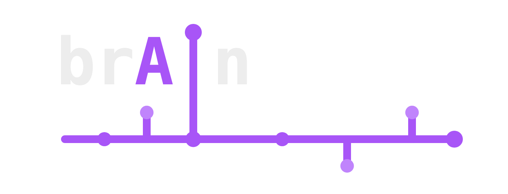
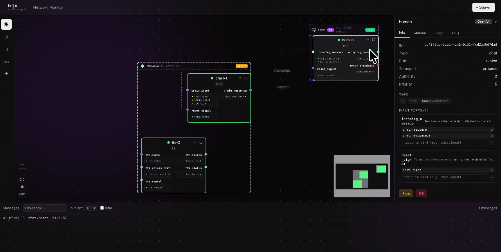
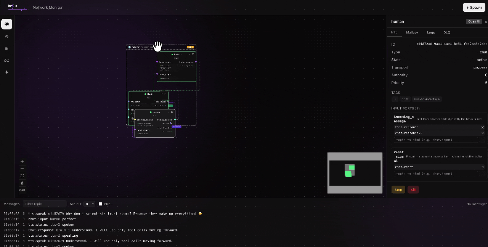
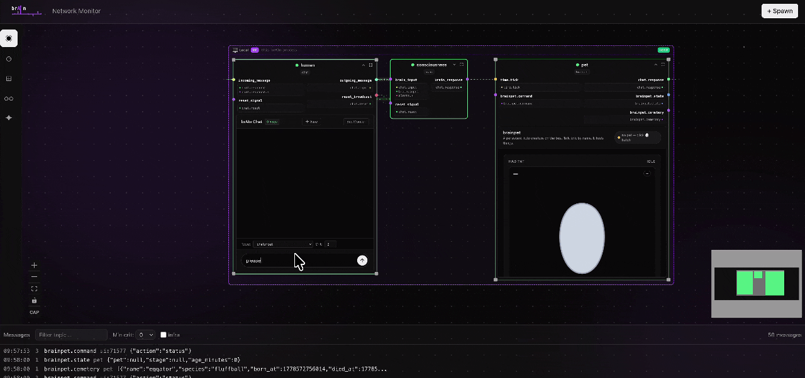
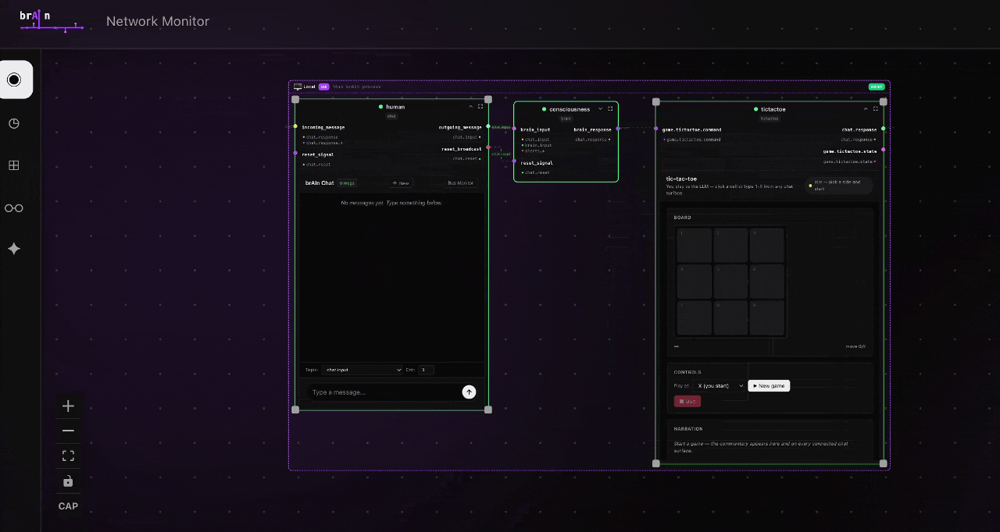

<p align="center">
  <picture>
    <source media="(prefers-color-scheme: dark)" srcset=".github/assets/brain-logo.png" />
    <source media="(prefers-color-scheme: light)" srcset=".github/assets/brain-logo-light.png" />
    
  </picture>
</p>

<p align="center"><strong>Bus-Reactive Ambient Intelligent Nodes</strong></p>

## Hey, I'm Thibaut 👋

I'm a Flutter mobile and AI engineer, and honestly I've never been
satisfied with the agent frameworks out there. Most of them boil down to a loop or a cron
poking a model on a timer, with everything funnelled through a single
chat. So I tried to build the thing I actually wanted to use. Full
transparency: I leaned on AI heavily to write this code (that's part of
the experiment too), and I think what came out is worth sharing.

Under the hood it's really a NATS pub/sub bus with long-lived daemon
nodes, closer in spirit to ROS than to a chat framework. The LLM is just
one thing a node can reach for, not the center of gravity.

A few things I think it gets right:

- **It doesn't burn tokens waiting.** Nodes are *reactive*, not
  scheduled. They stay parked and only call the LLM when a message they
  actually care about arrives. No cron, no idle polling, so you pay for
  thinking instead of ticking.
- **Every node can have its own interface, local or remote.** A node
  isn't just a handler; it can ship a UI, and that UI stays reusable and
  reachable even when the node runs on another machine.
- **You watch your agents, not a chat box.** Instead of one conversation
  doing everything, you get a live graph of small, dedicated nodes, each
  with one job and its own view.
- **You can spread the load.** The same node runs in-process or on a
  remote machine joined to the shared bus. Distribute work across
  hardware without touching the code.

It's not a polished product and it's not trying to replace anything.
It's my honest attempt at a problem I don't think is solved yet. If any
of this resonates, take a look.

## See it in action

### A live graph of your whole network



The dashboard *is* the network: every node, the messages flowing between
them, and the wiring you edit by dragging. No single chat, just each
agent doing its own job.

### Distributed across machines



Two machines share one bus and one canvas. Nodes spawned on a peer show
up next to the local ones, so you can spread the load across hardware.
The wiring doesn't care where a node actually lives.

### Each node can ship its own UI



A node is more than a function: it can serve its own interface. Here a
small "brainpet" node with a dedicated UI, reusable and reached the same
way whether it runs locally or on a remote peer.

### Reach your nodes from anywhere



A tic-tac-toe node played through the Telegram bridge. The same node
logic is exposed over an external channel, so interfaces stay reusable
across the bus, even off your machine.

---

## How brAIn relates to other tools

brAIn isn't a competitor to most of the agentic tools you may know;
they solve adjacent problems and the right one depends on the shape
of the agent you want.

**LangGraph / Vercel AI SDK / Mastra**: for chat-shaped agents
(user types → LLM thinks → tools → LLM responds), these are
excellent and deeper than brAIn's chat support. Reach for them when
the agent is fundamentally a conversational interface.

**AutoGen / CrewAI**: multi-agent conversations with roles. Use
these when you want several LLM personas debating or collaborating
within a single dialogue.

**ROS 2**: the closest architectural cousin. Pub/sub bus, daemon
nodes, multi-language, cross-machine over DDS. brAIn shares a lot
of its mental model with ROS. The differences are domain-specific:
brAIn is built around LLM constraints (token budgets, abortable
inference, tool-call loops, MCP), runs over NATS rather than DDS
(easier to deploy when you don't need real-time guarantees), and
preempts at the work-in-progress level rather than between
callbacks.

**Inngest / Trigger.dev / Temporal**: durable workflows. If your
agent is a finite-shape DAG with retries and backoff, those are
production-grade options. brAIn's nodes are open-ended daemons;
the two run on different mental models.

**n8n / Flowise / Langflow / Dify / Node-RED**: visual
node-based authoring. brAIn nodes are written in code (a
TypeScript handler plus a `config.json`, or any HTTP/WS service
via `transport: "web"`). The dashboard is observation-first.

**Claude Cowork / OpenAI scheduled tasks / cron-driven agents**:
time-triggered prompts. brAIn is event-triggered; if your agent's
cadence is "every Monday morning summarise X", a scheduler is the
right primitive.

A condensed comparison of the architectural traits brAIn happens to
have, for context:

| | brAIn | LangGraph | AutoGen | ROS 2 |
|---|---|---|---|---|
| Long-lived daemon nodes | yes | graph runs per call | per conversation | yes |
| Many-to-many bus | yes | inputs flow through the graph | conversation channel | yes |
| Mid-handler abort on priority | yes (LLM/CLI/MCP signal-aware) | no | no | priorities at the queue level |
| LLM-native primitives | yes | yes | yes | no |
| Cross-machine | NATS | no | no | DDS |
| MCP client | yes (4 transports) | per-tool wrappers | per-tool wrappers | no |
| Causal trace + replay | yes (`/network/traces/:id/replay`) | LangSmith captures traces | no | no |

---

A runtime for autonomous agents that live in a **many-to-many event
world**.

Nodes are long-lived daemons. Each one subscribes to several input
streams (chat messages, sensor events, webhooks, internal bus
traffic, anything you can publish), reacts when something relevant
shows up, and can publish to as many outputs in parallel. There's no
single triggering channel: the agent watches and decides when to
act.

A node may also be preempted mid-flight: when a higher-criticality
message lands during a slow operation (an LLM call, a tool
invocation, a CLI agent), the runner aborts what's in progress and
re-runs the handler with the new context surfaced in
`ctx.preemptionContext`. Same node config can run in-process, behind
a WebSocket, or on a remote `brain-agent` joined to a shared NATS
bus.

---

## Concretely

A few shapes you can build with this:

- An **ambient room agent** that watches camera + mic and only
  speaks when someone is looking at it while talking (the flagship
  demo: voice + gaze + intent + brain).
- A **Slack-channel listener** that lives in a thread, picks up
  context across messages, and summarises or replies when the
  conversation pauses.
- A **monitoring agent** subscribed to Grafana alerts +
  oncall-rotation events + recent deploys, that surfaces a
  hypothesis when a correlation crosses a threshold.
- An **IoT controller** that fuses temperature, motion, calendar,
  and time-of-day to decide when to change the environment.

The framework's primitives:

- **Daemon model**: nodes live across iterations; the framework
  auto-parks them when idle and the bus wakes them on the next
  subscribed message. State persists across runs.
- **Many-to-many I/O**: each node subscribes to N topic patterns
  (with wildcards) and publishes to as many.
- **Criticality with preemption**: every message carries a
  criticality. A higher-criticality message arriving mid-handler
  aborts the running iteration and triggers a re-run with
  `ctx.preemptionContext.{interrupting_message, previous_messages}`
  available.
- **Distributed runtime**: same node config runs in-process or on
  a remote `brain-agent`. Lifecycle (stop / start) and read-back
  (logs / mailbox / DLQ) work transparently across machines over
  NATS.
- **MCP-native**: `mcp-config` (manager) + `mcp-server` (one per
  upstream) bridge any MCP server's tools onto the bus, so the
  agent reaches into filesystem, git, Slack, Linear, Notion,
  Sentry … as it would call any other node.

---

## Engine

### Bus + mailboxes

`packages/core/src/bus`: `NatsBusService` implements `IBusService`
on top of a NATS broker. The framework boots an embedded
`nats-server` (the bundled Go binary, downloaded by the postinstall
hook) on a free localhost port; remote `brain-agent` processes
connect to that same broker and share the bus. Set
`BRAIN_NATS_URL` to skip the embedded broker and join an external
one instead, typical when running across multiple hosts.

`BusService` (in-memory) is still exported but only as a test
fixture; the production code path always goes through NATS.

Features:

- Wildcard topic matching (`alerts.*`).
- Per-subscription **mailbox** with configurable `max_size` and a
  `latest` / `lowest_priority` retention policy. `dropped` and
  `capacity` are exposed so the dashboard can show per-mailbox
  backpressure.
- **Causal traces**: every message carries `trace_id` + `parent_id`.
  Survives NATS encode/decode, queryable via
  `GET /network/traces/:id`. Each trace can be **replayed** as fresh
  emissions through `POST /network/traces/:id/replay`: fresh ids,
  rewritten parent chain, original `trace_id` carried as
  `metadata.replayed_from` for debugging.
- **History** sliding window (10k messages by default).

### Runners

`packages/core/src/runner`, picked from a node's tags:

- **`ServiceRunner`** for reactive non-LLM nodes (memory, http-bridge,
  terminal, …): message arrives → handler called once → node parks
  until the next subscribed message arrives.
- **`LLMRunner`** for LLM nodes (brain, memory-proxy,
  memory-consolidator): handler called in a budget loop (default 5
  iterations). New messages **reset the budget** (fresh attention).
  When exhausted → node parks until something rewakes it.

### Preemption

When a higher-criticality message lands while a handler is running,
the runner aborts the iteration instead of waiting it out.

`ctx.signal` is an `AbortSignal` exposed to every handler. LLM
handlers pass it to `generateText({ abortSignal: ctx.signal })`, CLI
nodes to `spawn(..., { signal })`, MCP nodes to
`client.callTool(..., { signal })`. The abort propagates through to
the underlying HTTP request, so a long inference at the LLM provider
or a long subprocess invocation gets cut at the source, not just
queue-reordered between iterations.

The threshold (how much higher the incoming criticality must be) is
configurable; default is 3. The next handler invocation runs with
`ctx.wasPreempted = true` and the preemption details in
`ctx.preemptionContext`.

### Distributed runtime: `brain-agent`

`packages/agent` ships a `brain-agent` CLI binary that joins the
shared NATS bus and hosts nodes on a remote machine. It announces
itself every 10 s, subscribes to its control topics
(`brain.agents.<self>.{spawn,kill,stop,start}`), and answers
read-back requests for `logs / mailboxes / dead_letters` via NATS
request-reply. The dashboard's **Agents** tab lists every live agent
and the Node Creator's **Target** dropdown lets you pick "Local" or
any agent for a new spawn. When an agent stops announcing past
~30 s, its remote-node stubs are automatically pruned from the API.

### MCP: `mcp-config` + `mcp-server`

Lives in [brAIn-essentials](https://github.com/tibzejoker/brAIn-essentials).
`mcp-config` owns a single Claude-Desktop-shaped JSON
(`{mcpServers: {...}}`) and reconciles it by spawning / killing
`mcp-server` children, one per upstream. Each `mcp-server` connects
via the official `@modelcontextprotocol/sdk` and exposes each tool
as its own bus topic `mcp.<alias>.<tool>`, so callers wire to
capabilities directly. Status, OAuth state and tool catalog are on
`mcp.<alias>.{status,tools,oauth.required}`. Four transports
supported per upstream: `stdio`, `http` (Streamable HTTP), `sse`,
`ws`. `ctx.signal` propagates, so preemption kills MCP calls in
flight.

### Observability

- **DLQ**: every message in flight when a handler crashes / times
  out is captured in a per-runner ring (50 entries). Surfaced under
  the NodePanel's DLQ tab; the tab badge flips red on first entry.
- **Backpressure**: each mailbox tracks `dropped` (cumulative
  evictions) and `capacity`. The Mailbox tab shows a fill bar
  coloured by load.
- **Tracing**: any message in the history can be opened as a tree in
  the dashboard, with one-click replay.

### Persistence

SQLite (`data/brain.db`) via `better-sqlite3`. Spawned nodes,
subscriptions, mailbox config, and dormancy state all survive restarts.

### Authoring a node

Three minimum files under `nodes/<your-node>/`. Wiring is declared
with **ports**: each node states its input/output ports (the immutable
contract) plus `default_port_bindings` mapping every port to the bus
topics it listens on or emits to. Every input port carries a JSON
Schema, so it shows up as a typed, callable tool. There is no
auto-derivation: a node without explicit ports is rejected at
registration.

```jsonc
// config.json
{
  "name": "my-node",
  "description": "What this node does",
  "tags": ["utility"],
  "default_authority": 0,
  "default_priority": 1,
  "ports": {
    "inputs": {
      "command": {
        "description": "What this node accepts (becomes an MCP tool).",
        "inputSchema": { "type": "object", "properties": { "x": { "type": "string" } } }
      }
    },
    "outputs": {
      "result": { "description": "What this node emits." }
    }
  },
  "default_port_bindings": {
    "inputs": { "command": ["some.topic"] },
    "outputs": { "result": ["some.output"] }
  },
  "supports_transport": ["process"],
  "has_ui": false
}
```

```typescript
// src/handler.ts
import type { NodeHandler, NodeOnSpawn, NodeTeardown } from "@brain/sdk";

export const onSpawn: NodeOnSpawn = async (info) => {
  // boot external resources (child processes, sockets, …)
};

export const handler: NodeHandler = async (ctx) => {
  for (const msg of ctx.messages) {
    ctx.publish("some.output", {
      type: "text",
      criticality: 1,
      payload: { content: `Got: ${JSON.stringify(msg.payload)}` },
    });
  }
  // Pass ctx.signal to anything long-running so the runner can
  // preempt this iteration when an urgent message lands.
};

export const teardown: NodeTeardown = async () => {
  // release whatever onSpawn acquired
};
```

`supports_transport` may include `"process"` (in-tree TS handler),
`"web"` (external HTTP/WS service, also requires a `web: { url }`
block), and/or `"remote"` (any node hosted on a brain-agent).

The type is auto-discovered on engine boot, or registered live via
the dynamic scanner if dropped under `nodes/_dynamic/`.

---

## Nodes

This repo ships zero nodes: `nodes/` only contains a `_dynamic/`
slot for the runtime scanner. Every capability comes from a sister
repo, installed via the in-app Marketplace tab (backed by
[brAIn-store](https://github.com/tibzejoker/brAIn-store)). A library
can ship its own ready-made workflows (seed YAMLs) that show up once
it's installed.

- [**brAIn-essentials**](https://github.com/tibzejoker/brAIn-essentials):
  `brain` (LLM orchestrator with a tolerant tool-call parser),
  `developer` (writes new node types at runtime via Claude / Codex
  / Gemini CLIs), `attention`, `clock`, `cron`, `echo`, `mcp-config`
  + `mcp-server`.
- [**brAIn-memory**](https://github.com/tibzejoker/brAIn-memory):
  `memory` (KV + tags), `memory-vector` (LanceDB + Ollama
  embeddings), `memory-proxy` (LLM-mediated gateway: the brain
  talks here, never to the underlying stores),
  `memory-consolidator`, `reminder`.
- [**brAIn-tools**](https://github.com/tibzejoker/brAIn-tools):
  `terminal`, `http-bridge`, `calc-py` (Python node behind a
  WebSocket, demonstrates `transport: "web"`).
- [**brAIn-llm**](https://github.com/tibzejoker/brAIn-llm):
  `llm-basic` (Vercel AI SDK wrapper), `llm-cli` (Claude Code /
  Codex / Gemini wrapper).
- [**brAIn-ui**](https://github.com/tibzejoker/brAIn-ui): `chat`
  (browser interface for human ↔ network).
- [**brAIn-perception**](https://github.com/tibzejoker/brAIn-perception):
  `voice` (faster-whisper + WeSpeaker), `gaze` (InsightFace +
  Gazelle + Moondream), `intent` (voice × gaze correlator).
- [**brAIn-bridges**](https://github.com/tibzejoker/brAIn-bridges):
  `telegram`, `discord`, `whatsapp` (reach the network from a
  chat app, off your machine).
- [**brAIn-games**](https://github.com/tibzejoker/brAIn-games):
  `brainpet`, `hangman`, `tictactoe` (playable nodes, each with
  its own UI).
- [**brAIn-demo-loneliness**](https://github.com/tibzejoker/brAIn-demo-loneliness):
  `phone-loneliness` (a small demo scenario).

### Showcase: ambient perception

`voice` publishes `voice.transcript`, `gaze` publishes
`gaze.target.resolved`, `intent` matches them on a sliding window
and emits `intent.detected` when the same person is seen looking at
the camera while talking. Combined with `brain` and `chat`, the
room agent responds without a wake word or a chat-box input. The
voice and gaze servers auto-install their virtualenv and download
the ML weights on first spawn.

---

## Quickstart

### One-command install

```bash
npm create brain
# or pick a folder name:
npm create brain my-instance
```

This bootstraps the dev workspace via the [`create-brain`](./scripts/installer)
package: clones `brAIn/` and `brAIn-store/`, creates an empty
`storeprojects/` directory, runs `pnpm install` (downloads the bundled
`nats-server` binary, builds the framework), **and launches the stack**.
End-to-end, one command. Layout produced:

```
brain/                    (default folder)
├── brAIn/                framework
├── brAIn-store/          marketplace registry
└── storeprojects/        empty, filled at runtime by `pnpm brain pull`
```

Once it boots (first boot takes ~1 min while the auto-seed clones a few
sister repos), open:

```
API       → http://localhost:3000
Dashboard → http://localhost:5173
```

To stop without auto-launch (just clone + install) pass `--no-start`.
To re-launch later: `cd brain/brAIn && ./run` (`run.cmd` on Windows).

### Prerequisites

- **Node.js** ≥ 20 (pnpm is auto-bootstrapped via `corepack` if missing)
- **git** in `PATH`
- **Ollama** only if you install LLM nodes (`ollama pull gemma4:e4b`,
  `ollama pull qwen3-embedding:0.6b`)
- **Python 3.11** only if you install the perception nodes (voice / gaze)
  from [brAIn-perception](https://github.com/tibzejoker/brAIn-perception)

`nats-server` ships embedded; `pnpm install` fetches the right binary
for your platform. Set `BRAIN_NATS_URL` to skip the embedded broker and
join an external one instead.

### Manual install (contributors)

If you're going to hack on the framework itself:

```bash
git clone https://github.com/tibzejoker/brAIn && cd brAIn
pnpm install            # postinstall: builds sdk/core/agent, clones
                        # brAIn-store, downloads nats-server binary
pnpm start
```

### Adding nodes

```bash
pnpm brain list                  # marketplace registry: installed + available
pnpm brain pull memory           # install a node from the marketplace
pnpm brain remove memory --yes   # uninstall the node's parent sister repo
```

Or open the dashboard's **Marketplace** tab. Workflows (seed YAMLs)
ride along with their library: install a lib and its seeds appear in
the **Seeds** view, ready to apply as a pre-wired starter network.
You can also snapshot your running network as a personal seed.

#### Authoring locally

- **Custom node**: drop `nodes/_dynamic/<your-node>/{config.json,
  dist/handler.js}`; the dynamic scanner registers it on the fly,
  no restart.
- **Custom seed**: snapshot the running network from the dashboard's
  **Seeds** view (or drop a YAML the framework can read). Apply via
  the dashboard or `POST /network/seeds/<name>/apply`.

### Hosting nodes on another machine

On the API host, open the Distributed tab and click **Open to LAN**
once. That binds the embedded broker on `0.0.0.0` and pins an auth
token. The panel shows a one-liner snippet, copy it.

On the target machine:

```bash
npm create brain
cd brain/brAIn
pnpm brain pull memory          # (or whichever nodes the agent should host)
# paste the snippet from the Distributed tab:
BRAIN_NATS_URL=nats://<api-lan-ip>:<port> BRAIN_NATS_TOKEN=<token> npx brain-agent
```

The agent shows up in the Distributed tab. From the Node Creator,
pick it as **Target** to spawn nodes on it.

Pin the broker port across restarts with `BRAIN_BROKER_PORT=4222`.
Run an external broker with `BRAIN_NATS_URL=nats://<host>:<port>`:
the API skips the embedded one and joins yours.

### Cleanup

```bash
pnpm kill-orphans       # smart cleanup by cmdline + ports
pnpm kill-ports         # blunter
```

---

## REST API

```
# Nodes
GET    /nodes                  List
GET    /nodes/:id              Detail
POST   /nodes                  Spawn  { type, name, transport?,
                                        target_agent_id?, … }
DELETE /nodes/:id              Kill
POST   /nodes/:id/{stop,start,tick}
PATCH  /nodes/:id/config       Update config_overrides
PATCH  /nodes/:id/position     Persist dashboard layout
GET    /nodes/:id/{logs,mailboxes,dead-letters}
POST   /nodes/:id/ports/:side/:port/topics          Bind a port to a topic
DELETE /nodes/:id/ports/:side/:port/topics/:topic   Unbind

# Types
GET    /types
POST   /types/register   { path }
DELETE /types/:name

# Network + traces
GET    /network                          Full snapshot
GET    /network/messages                 History
GET    /network/history                  Lifecycle audit log
GET    /network/transport                { nats, url? }
GET    /network/{providers,devmode}
POST   /network/{devmode,tick,reset}
GET    /network/traces/:trace_id         Walk a causal chain
POST   /network/traces/:trace_id/replay  Re-publish as fresh emissions
GET    /network/seeds                    List on-disk YAML seeds
POST   /network/seeds/:name/apply        Apply a seed (?merge=true to add)

# Store (marketplace)
GET    /store/{index,nodes,candidates,upstream-status,installed-updates}
POST   /store/install            { package_name }
POST   /store/uninstall          { package_name }
POST   /store/refresh            Pull brAIn-store

# Agents (distributed)
GET    /agents

# Node UI
GET    /nodes/:id/ui/            Static node UI
POST   /nodes/:id/ui/send        Publish into the node
GET    /nodes/:id/ui/messages    Conversation log

# MCP OAuth callback
GET    /mcp/oauth/callback
```

WebSocket events on `/socket.io`: `node:spawned`, `node:killed`,
`node:state_changed`, `message:published`.

---

## Tech stack

- **SDK**: TypeScript, types-only package consumed by every node.
- **Core**: TypeScript engine: pino, eventemitter3, better-sqlite3,
  ws, nats.js, ai (Vercel SDK), `@modelcontextprotocol/sdk`.
- **API**: NestJS 10 + Socket.IO + express.
- **Agent**: `brain-agent` CLI binary (`packages/agent`) for
  remote-host node execution over the shared bus.
- **Dashboard**: React 19, React Flow, d3-force, Tailwind v4, Vite.
- **Bus**: NATS by default (an embedded `nats-server` boots on a free
  port, or join an external broker with `BRAIN_NATS_URL`); the
  in-memory `BusService` exists only as a test fixture.
- **Persistence**: SQLite via better-sqlite3.
- **Monorepo**: pnpm workspaces, with cross-repo sibling
  resolution to the checked-out companion repos under
  `../storeprojects/brAIn-*/nodes/*`. Missing paths are silently
  ignored.
- **Marketplace**: `../brAIn-store` is auto-cloned by the
  postinstall hook; the dashboard's Marketplace tab installs nodes
  from it (SHA-pinned, per-file checksums), and each library brings
  its own seeds.
- **Cross-language nodes**: `packages/python-sdk` (`brain-web`)
  helper for nodes that speak the bus from Python over WebSocket
  (`transport: "web"`).
- **Tests**: vitest, with optional integration suites that gate on
  the relevant dependency being available (NATS, Ollama, MCP servers).

---

## Tests

```bash
pnpm test                                    # all
RUN_LLM_E2E=1 npx vitest run tests/preemption-llm-e2e.test.ts
RUN_MCP_E2E=1 npx vitest run tests/mcp-host-public-server-e2e.test.ts
```
